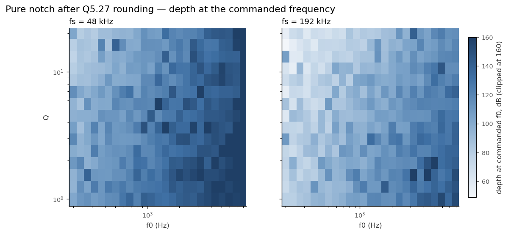
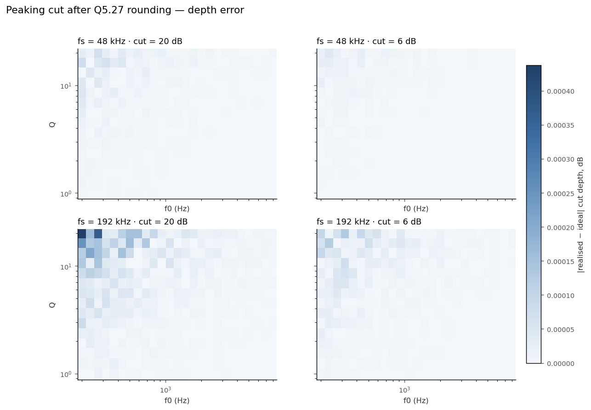
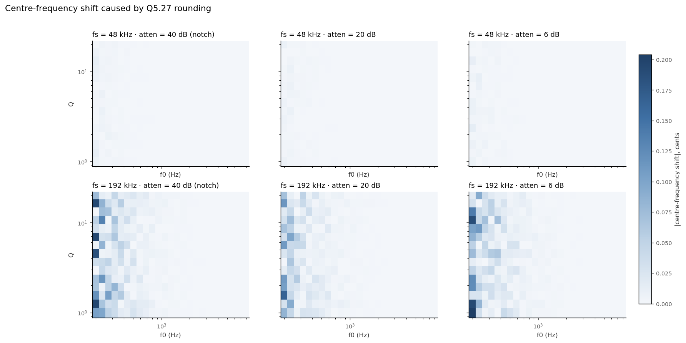
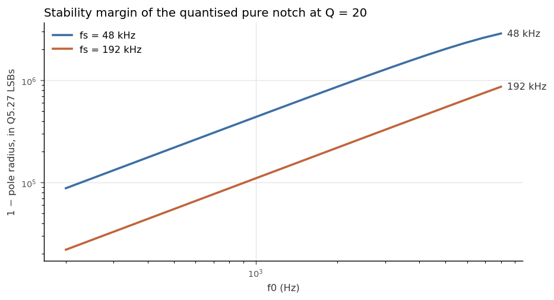

# Q5.27 quantisation of Haven's notch / peaking-cut biquads

Grid: f0 200–8000 Hz (25 log steps), Q 1–20 (15 log steps), atten ∈ {40, 20, 6} dB (40 = pure notch), fs ∈ {48000, 192000} Hz. Coefficients per `src/adau1860_control.c` `calc_band_coeffs()`, rounded to Q5.27.

## Effect A — coefficient quantisation (exact arithmetic)

Representability / stability after rounding:

- fs=48000 atten=40 dB: 375/375 designs stable and representable
- fs=48000 atten=20 dB: 375/375 designs stable and representable
- fs=48000 atten=6 dB: 375/375 designs stable and representable
- fs=192000 atten=40 dB: 375/375 designs stable and representable
- fs=192000 atten=20 dB: 375/375 designs stable and representable
- fs=192000 atten=6 dB: 375/375 designs stable and representable

Worst case over the whole grid (|value| max):

| fs (Hz) | atten (dB) | max |depth err| (dB) | min depth at commanded f0 (dB) | max |f0 err| (cents) | max |f0 err| (Hz) | min pole margin (LSBs of Q5.27) | min pole margin (1−r) |
|---|---|---|---|---|---|---|---|
| 48000 | 40 | n/a (notch) | 75.9 | 0.0120 | 0.00138 | 87807 | 6.54e-04 |
| 48000 | 20 | 0.0001 | — | 0.0087 | 0.00117 | 277473 | 2.07e-03 |
| 48000 | 6 | 0.0000 | — | 0.0143 | 0.00165 | 124013 | 9.24e-04 |
| 192000 | 40 | n/a (notch) | 48.9 | 0.1958 | 0.02263 | 21959 | 1.64e-04 |
| 192000 | 20 | 0.0004 | — | 0.1655 | 0.01912 | 69429 | 5.17e-04 |
| 192000 | 6 | 0.0001 | — | 0.2041 | 0.02358 | 31018 | 2.31e-04 |

Pure notch (atten=40 → full notch). RBJ gives b0 = b2 exactly, and rounding preserves that equality, so the quantised zeros stay *on* the unit circle: the notch is still infinitely deep, just shifted by Δf0. The Haven-relevant number is therefore the depth at the *commanded* f0, which is finite only because of that shift:

| fs (Hz) | f0 (Hz) | Q | depth at commanded f0 (dB) | Δf0 (Hz) | Δf0 (cents) |
|---|---|---|---|---|---|
| 48000 | 200 | 1.0 | 102.0 | -0.0008 | -0.007 |
| 48000 | 8000 | 1.0 | 240.0 | +0.0000 | +0.000 |
| 48000 | 200 | 20.0 | 103.1 | +0.0000 | +0.000 |
| 48000 | 8000 | 20.0 | 240.0 | +0.0000 | +0.000 |
| 48000 | 1265 | 4.5 | 117.1 | -0.0002 | -0.000 |
| 192000 | 200 | 1.0 | 78.4 | -0.0120 | -0.104 |
| 192000 | 8000 | 1.0 | 153.5 | -0.0001 | -0.000 |
| 192000 | 200 | 20.0 | 55.2 | -0.0087 | -0.075 |
| 192000 | 8000 | 20.0 | 115.6 | +0.0003 | +0.000 |
| 192000 | 1265 | 4.5 | 98.2 | -0.0017 | -0.002 |

Peaking-cut depth error, worst three per (fs, atten):

| fs (Hz) | atten (dB) | f0 (Hz) | Q | ideal depth (dB) | Q5.27 depth (dB) | error (dB) | Δf0 (cents) |
|---|---|---|---|---|---|---|---|
| 48000 | 20 | 200 | 16.1 | 20.000 | 20.000 | +0.0001 | +0.001 |
| 48000 | 20 | 272 | 20.0 | 20.000 | 20.000 | -0.0001 | -0.002 |
| 48000 | 20 | 317 | 16.1 | 20.000 | 20.000 | -0.0001 | -0.002 |
| 48000 | 6 | 233 | 20.0 | 6.000 | 6.000 | +0.0000 | -0.001 |
| 48000 | 6 | 233 | 16.1 | 6.000 | 6.000 | -0.0000 | -0.000 |
| 48000 | 6 | 200 | 16.1 | 6.000 | 6.000 | +0.0000 | +0.001 |
| 192000 | 20 | 200 | 20.0 | 20.000 | 20.000 | -0.0004 | -0.070 |
| 192000 | 20 | 272 | 20.0 | 20.000 | 20.000 | +0.0004 | +0.000 |
| 192000 | 20 | 200 | 16.1 | 20.000 | 20.000 | -0.0003 | -0.114 |
| 192000 | 6 | 317 | 20.0 | 6.000 | 6.000 | -0.0001 | +0.018 |
| 192000 | 6 | 233 | 16.1 | 6.000 | 6.000 | -0.0001 | -0.001 |
| 192000 | 6 | 200 | 20.0 | 6.000 | 6.000 | -0.0001 | -0.017 |

### Q1.31 for comparison

Q1.31 cannot hold |coefficient| ≥ 1, and every Haven biquad has a1 ≈ −2cos(ω0) with magnitude > 1. Representable pure-notch designs in Q1.31: fs=48000: 18/375, fs=192000: 0/375. Q1.31 would need coefficient pre-scaling by ½ and a compensating shift in the datapath; not applicable to FastDSP as upstream drives it (unity = 1<<27).

## Effect B — coefficient + Q5.27 state rounding (direct-form-I model)

Model, not a FastDSP simulation (accumulator width undocumented). Drive: 0.25 FS tone at f0 + a −40 dB tone 3 bandwidths above (must pass). Reports realised attenuation of each and the rounding-noise floor.

| fs (Hz) | f0 (Hz) | Q | atten cmd (dB) | realised att @f0 (dB) | side tone att (dB) | ideal side att (dB) | noise floor (dBFS) | sim (s) |
|---|---|---|---|---|---|---|---|---|
| 48000 | 200 | 20 | 40 | 98.3 | 0.25 | 0.14 | -88.1 | 0.68 |
| 192000 | 200 | 20 | 40 | 55.2 | 0.24 | 0.13 | -87.6 | 0.68 |
| 48000 | 200 | 20 | 20 | 20.0 | 1.28 | 1.19 | -86.4 | 0.68 |
| 192000 | 200 | 20 | 20 | 20.0 | 1.27 | 1.18 | -86.2 | 0.68 |
| 48000 | 200 | 1 | 40 | 105.4 | 0.30 | 0.30 | -113.9 | 0.68 |
| 192000 | 200 | 1 | 40 | 78.6 | 0.30 | 0.30 | -110.6 | 0.68 |
| 48000 | 4500 | 10 | 40 | 133.9 | 0.13 | 0.13 | -122.2 | 0.68 |
| 192000 | 4500 | 10 | 40 | 127.7 | 0.15 | 0.15 | -121.9 | 0.68 |
| 48000 | 4500 | 10 | 20 | 20.0 | 1.14 | 1.14 | -122.8 | 0.68 |
| 192000 | 4500 | 10 | 20 | 20.0 | 1.29 | 1.29 | -123.0 | 0.68 |
| 48000 | 8000 | 20 | 40 | 150.5 | 0.09 | 0.09 | -117.8 | 0.68 |
| 192000 | 8000 | 20 | 40 | 115.5 | 0.13 | 0.13 | -117.7 | 0.68 |
| 48000 | 8000 | 1 | 6 | 6.0 | 1.28 | 1.28 | -105.6 | 0.68 |
| 192000 | 8000 | 1 | 6 | 6.0 | 0.35 | 0.35 | -106.8 | 0.68 |

